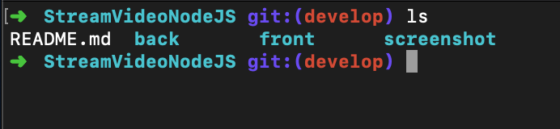
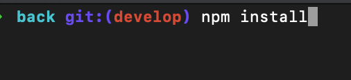
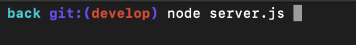
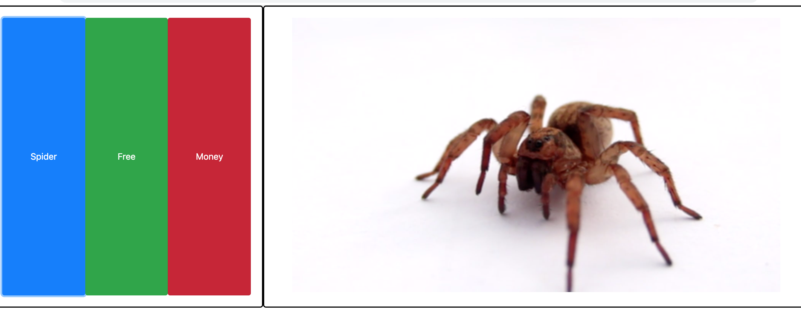

# StreamVideoNodeJS
Exemplo de stream de video usando Node.js

#Você deve ter em seu PC:

- NPM
	- npm -v (Verificar se o npm esta instalado)
- NODE.JS
	- node -v (Verificar se o node esta instalado)
- NAVEGADOR (Safari,Google Chrome e etc)

#Como executar o projeto?

- Abra o terminal e navegue até o diretorio do projeto

- Abra a pasta Back
- Execute o comento npm install	

- Após terminar de instalar todas as dependencias, execute o comendo
 	 node server.js (Com isso, você ira rodar o arquivo server.js e podera acessar a API atraves da URL
 	 http://localhost:8001
 	 )

- Agora volte uma pasta e acesse a pasta Front
- Abra o arquivo index.html em seu navegador
- Você tera uma tela como essa:

